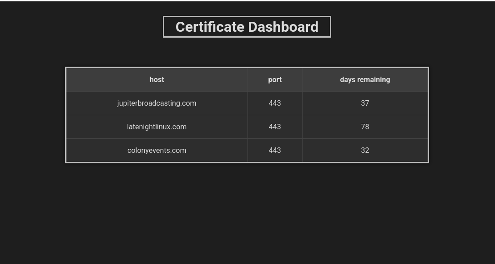

# https-certificate-expiry-monitor

This is a Python web app to monitor your https website certificates expiration dates. It displays warning and critical colors based on number of days set in the config.ini file. Defaults are `warn_days=14` and `critical_days=7`

**This software has not been checked for security vulnerabilities; use it at your own risk and only inside a secure network.**

## Current working features
- Checks sites ~~added to the config.ini file~~ and changes cell colors based on warning and alert days in config file.
- Sites can be added to the database by adding them to config.ini but they will be removed from that file when they are added to the database.
- Sites (endpoints) are managed in the app.
- uses a sqlite database to store the endpoints.

## Screenshot

favicon.ico by [Arkinasi](https://www.freepik.com/icons/ssl)

Save and Delete icons are part of "Angular Icons" icon set designed by [Dennis Snellenberg](https://iconduck.com/designers/dennis-snellenberg).

This project is based on [codebox/https-certificate-expiry-checker](https://github.com/codebox/https-certificate-expiry-checker)
